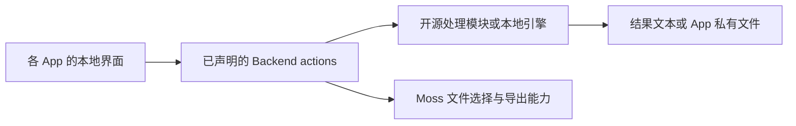

# 本地工具 App 选型与接入方案

应用划分更新：2026-10-10。HTTP 调试已合并到 [moss.devtools](../apps/devtools/README.md)，不再单独提供 `moss.http-client`。原始验证范围见 [开发工具记录](devtools-app-verification.md) 和 [HTTP 历史记录](http-client-app-verification.md)；图片和音视频 App 仍为源码调研与实施设计，尚未创建或完成实际转码测试。

目标是把不同开源项目中的实用能力接入 Moss Desktop，形成多个可以独立安装、升级和停用的本地 App。用户已选择按开发工具、图片工具、音视频工具等类别拆分。HTTP 调试作为开发工具中的工作区，与转换工具共用应用入口。

## 三类 App

| App | 建议 ID / 目录 | 首版功能 | 开源来源与集成方式 |
| --- | --- | --- | --- |
| 开发工具 | `moss.devtools` / `apps/devtools` | 时间戳、Base64 文本转换、JSON 格式化/压缩/校验、AES 加解密；HTTP 请求、鉴权、响应查看和模板 | 转换工具参考 [Ctool](https://github.com/baiy/Ctool) 和 [OmniTools](https://github.com/iib0011/omni-tools)，HTTP 交互参考 [Hoppscotch](https://github.com/hoppscotch/hoppscotch)；使用标准 API 与 App 自带 Node Backend |
| 图片工具 | `moss.image-tools` / `apps/image-tools` | JPEG/PNG/WebP/AVIF 转换，压缩、缩放、裁剪、批量处理与预览 | [OmniTools](https://github.com/iib0011/omni-tools) 的图片工作流 + [sharp](https://github.com/lovell/sharp) 本地处理引擎；纯 JS 轻量版本可考虑 [Jimp](https://github.com/jimp-dev/jimp) |
| 音视频工具 | `moss.media-tools` / `apps/media-tools` | 格式转换、提取音轨、剪裁、压缩、视频转 GIF，任务进度与取消 | [FFmpeg / ffprobe](https://github.com/FFmpeg/FFmpeg) 随 App 分平台打包；[OmniTools](https://github.com/iib0011/omni-tools)、[ConvertX](https://github.com/C4illin/ConvertX)、[VERT](https://github.com/VERT-sh/VERT) 提供可评估的工作流和实现来源 |

每个 App 保留自己的领域界面。开发工具采用工具列表与输入/结果编辑区；HTTP 调试采用请求编辑器与响应区；图片采用文件列表、预览和参数面板；音视频采用文件队列、输出设置和任务进度。

需要复制上游实现时，以选定版本中的具体文件及其依赖为单位记录来源、修改和许可证。Ctool/Hoppscotch 的 Vue 组件需适配本仓库常用的 React UI；也可保留 Vue 构建，Moss 的 UI 入口本身不要求 React。OmniTools 的 React 组件仍需处理版本、依赖和宿主接口适配。

## 选型依据与许可证

| 项目 / 引擎 | 核对结果 | 对本项目的意义 |
| --- | --- | --- |
| Ctool | 主项目 MIT；包含 AES、Base64、时间戳和 JSON；最近仓库推送为 2025-07 | 适合按模块移植开发工具，移植时重新检查依赖和算法兼容性 |
| OmniTools | 主项目 MIT；有图片转换、音频转码、视频处理、JSON、Base64 和时间工具 | 适合复用局部实现和交互；当前工具目录未找到 AES 或完整 HTTP 请求测试器 |
| Hoppscotch | 社区版 MIT，支持 REST/GraphQL/WebSocket 等 | 可从 HTTP 核心工作流开始适配，首版不依赖其账号、云同步或团队服务 |
| IT-Tools | GPL-3.0 | 可按 GPL 条件移植成独立 App；若复制源码进入其他 App，需要遵守对应许可证，不能统一标成 MIT |
| ConvertX / VERT | AGPL-3.0 | 可作为按 AGPL 发布的移植方案；本地媒体引擎方案单独使用 FFmpeg。VERT 的视频默认走其服务端，转换为本地 App 时必须改为本地执行 |
| sharp | Apache-2.0；依赖分平台原生运行文件和 libvips 等库 | 适合本地批量图片处理；包内需要保留传递依赖的许可证并验证目标架构 |
| Jimp | MIT、JavaScript 实现 | 适合减少原生打包工作；实际格式覆盖和性能应按首版样本验证 |
| FFmpeg | 默认 LGPL-2.1-or-later；可选组件/编译参数可能改变为 GPL 等 | 必须依据最终分发二进制的构建配置、编码器和依赖确认许可证与可分发条件 |
| ffmpeg.wasm | JS 封装 MIT，但当前 `@ffmpeg/core` 的包声明为 GPL-2.0-or-later | 可用于小文件或浏览器演示；不能根据封装仓库 MIT 标识推断整个转码包都是 MIT |

OmniTools 当前还依赖 AGPL-3.0 的 `@imgly/background-removal`。首版图片转换无需引入背景移除功能；后续接入时单独确定所采用版本和授权方式。项目根许可证不等于整个依赖树的许可证。

CryptoJS 的 README 已明确停止维护。新的 AES 模块优先使用原生 `crypto`，明确算法模式、密钥/IV 编码、填充和 GCM tag；与 CryptoJS 的口令派生/输出格式兼容需要单独实现和测试，不能只以“AES”名称认定兼容。

## Moss 已具备的接入能力

依据本仓库 [README](../README.md)、[SDK 说明](app-sdk.md) 和 [Manifest Schema](../vendor/moss-core/packages/app-sdk/src/schemas/app-manifest.schema.json)：

- 每个 App 独立维护 `app.moss.json`、`marketplace.json`、源码和版本，发布独立 ZIP。
- `ui.entry` 加载包内页面，启用后自动进入 Moss“更多”。本地工具的静态资源、字体、Worker 和 WASM 都应随包提供。
- 每个 App 有一个 Desktop 本地 Node Backend，可使用 `on-demand` 或 `persistent` 生命周期。
- UI 通过 `mossApp.actions.invoke()` 调用 Backend，操作通过 `backend.actions` 声明输入/输出 Schema。
- Backend 获得当前 App 的 `dataDir` / `runtimeDir`；文件选择等公开能力使用 `moss.platform/v1`。
- `contributes.tools` 只用于明确需要 AI 调用的能力，安装和管理时必须向用户展示。开发工具（含 HTTP 调试）仅提供页面操作，不注册 AI 工具。
- 已有 [OpenIM 构建脚本](../apps/openim/scripts/build.mjs) 可参考分平台原生运行文件的裁剪和打包。

接入关系：

开发工具和 HTTP 的短任务可使用 `on-demand`。图片批处理和音视频任务队列初期使用 `persistent`，任务操作返回 ID，页面通过查询与事件获取进度。当前按需 Backend 根据待处理调用判断空闲；返回任务 ID 后继续转码会有被空闲回收的风险，不能直接套用短任务生命周期。

各 App 使用 Backend action 实现界面操作。开发工具与 HTTP 调试不注册 AI 工具；其他 App 只有明确需要 AI 调用时才声明：

| 操作 | 建议 action | AI 工具效果 |
| --- | --- | --- |
| 格式化 JSON / 转换时间戳 | `json.format` / `timestamp.convert` | 不注册 AI 工具 |
| 执行 HTTP 请求 | `request.send` | 不注册 AI 工具 |
| 图片转换 | `image.convert` | 创建产物，声明 `write` |
| 创建转码任务 | `media.start` | 创建产物，声明 `write` |
| 查看任务进度 | `jobs.get` / `jobs.list` | 声明 `read` |

文件型工具先使用 App 已导入文件的标识；跨 App、Agent 附件与本地文件之间的受控资源交接需要确定契约。不能假设 App 可以直接读取其他 App 的数据目录。

## 需要先解决的实际接入问题

### 大文件导入和本地结果导出

当前固定引用的 SDK 是 `2.2.0`（Core 子模块提交 `7935e285c65cab7b20e5f1baab21f63a17aa7b54`）。已检查 [Platform 输入/输出校验](../vendor/moss-core/packages/app-sdk/src/platform/index.mjs)：

- `file.pick` / `file.materialize` 返回文件的大小上限是 `100 * 1024 * 1024`，即 100 MiB。
- `file.materialize` 的每次 Base64 输入上限为 512 KiB 字符，且文件总量仍受 100 MiB 限制。
- `file.download` 只接受 HTTP(S) URL，没有把 App 私有目录的结果文件直接另存为到用户目录的方法。

本地完整 Core checkout（检查提交 `c6fa4874cdd885c6735d714f3d741613e9d18262`）的 `ui/src/apps/app-platform-host.mjs` 也实施了 100 MiB 上限；选择文件时将其复制到 App 缓存，下载时把 HTTP 响应整体读入内存。它不适合作为大视频的导入/导出路径。

建议在 Core 的公共 Platform 协议增加受控大文件入口，以及从已授权 App 产物流式导出到系统保存对话框的能力。具体方法名、文件标识和权限仍需在 Core 定义；这些是拟增加能力，不是现有 SDK API。成功后先发布 Core/SDK，再更新本仓库的子模块引用和 App 的 `hostApi` 要求。

首版图片可在现有限额内验证转换核心；正式文件工作流必须验证本地导出。音视频完整交付需要覆盖超过 100 MiB 的输入。Backend 只传文件标识和小型元数据，不通过普通 JSON IPC 搬运完整媒体内容。

### 原生程序打包与退出清理

- sharp 的原生模块及运行依赖按 `marketplace.platforms` 打包并验证；仅声明实际经过验证的平台。
- FFmpeg / ffprobe 应使用固定版本，在构建时放入 `dist/backend/native/<platform>/`，随包记录构建配置、校验值和许可证。
- 当前 [打包脚本](../scripts/package-app.mjs) 未携带可执行权限元数据；检查到的 Core ZIP 解压实现以 `0600` 写文件。macOS/Linux 的 FFmpeg 不能假设解压后可直接执行。应设计受控运行副本及执行权限恢复，或在 Core 安装机制中支持明确声明的可执行文件，并验证代码签名/系统执行限制。
- 使用参数数组启动 FFmpeg，文件名和用户参数不拼接为 shell 命令。输入与产物限定到本 App 授权文件或目录。
- 普通 action 的声明超时最高为 300 秒；长转码采用任务机制，处理进度、失败、取消、重试和重启后的中断状态。
- Moss 管理的是 App Backend，FFmpeg 子进程的取消、退出和宿主断连清理由 App 负责。需要实测宿主正常退出和异常退出，不能仅凭 Backend 已停止推断转码进程已退出。

### 许可证和产物随包保留

[打包脚本](../scripts/package-app.mjs) 当前仅复制 `dist`、`schemas`、`assets` 以及根目录的 README/许可证文件。第三方说明和相关材料应放入会被打包的目录（例如 `assets/licenses/`），或扩充明确的打包规则，并检查最终 ZIP。FFmpeg 的源码提供等分发义务需按实际二进制许可证落实。

## 实施顺序与验收

1. **开发工具 App**：先实现时间戳、Base64、JSON、AES，完成本地 UI 和 Backend action，不注册 AI 工具；验证 Unicode、无效输入、大整数格式化、时区/毫秒，以及标准 AES 测试向量。
2. **开发工具中的 HTTP 调试**：验证本地测试服务的各类方法、请求体、鉴权、重定向、超时/取消和大响应。请求在 Node 执行，普通 HTTP 调试无需依赖浏览器 CORS 代理。响应正文按容量限制或分页读取，凭据不进入请求历史明文。
3. **公共文件能力 + 图片工具 App**：补齐保存路径，验证透明度、EXIF 方向、动画输入的处理策略、格式支持、批量部分失败与输出质量；HEIC/RAW 等按选定引擎构建能力另行加入。
4. **音视频工具 App**：完成 FFmpeg 跨平台运行包、长任务与大文件路径，验证视频/音轨转换、超过 100 MiB 的文件、取消、磁盘不足、宿主退出、产物可播放性。可选格式和编码器从实际二进制能力生成，不把容器后缀等同于编码器可用。

各 App 的交付包含源码、独立 Manifest 和市场信息、测试、构建与 ZIP。验证顺序是 action 样本测试、真实 Moss 容器中的 UI/文件交互、最终安装 ZIP 的离线运行；需要联网的 HTTP 请求单独验证目标连接。发布沿用仓库现有流程。

后续有两个以上 App 出现稳定重复代码时，再抽取宿主连接、产物管理和任务状态等公共模块；各 App 继续独立打包和版本管理。

## 主要来源

- [Ctool 功能列表](https://github.com/baiy/Ctool#功能列表)
- [OmniTools README](https://github.com/iib0011/omni-tools) 与 [工具目录](https://github.com/iib0011/omni-tools/tree/main/src/pages/tools)
- [Hoppscotch README / License](https://github.com/hoppscotch/hoppscotch)
- [sharp README / License](https://github.com/lovell/sharp) 与 [分平台依赖](https://github.com/lovell/sharp/blob/main/package.json)
- [FFmpeg 许可证及构建选项](https://github.com/FFmpeg/FFmpeg/blob/master/LICENSE.md)
- [ffmpeg.wasm core 包许可证](https://github.com/ffmpegwasm/ffmpeg.wasm/blob/main/packages/core/package.json)
- [背景移除依赖许可证](https://github.com/imgly/background-removal-js/blob/main/LICENSE.md)
- [CryptoJS 维护状态](https://github.com/brix/crypto-js#readme)
- [VERT 视频转换说明](https://github.com/VERT-sh/VERT/blob/main/docs/VIDEO_CONVERSION.md)
- [Moss App 创建规范](https://github.com/baiguidong/moss/blob/main/assistants/app-builder/assistant.md)、[Runtime](https://github.com/baiguidong/moss/blob/main/ui/docs/app-runtime.md)、[Platform 实现](https://github.com/baiguidong/moss/blob/main/ui/src/apps/app-platform-host.mjs)
